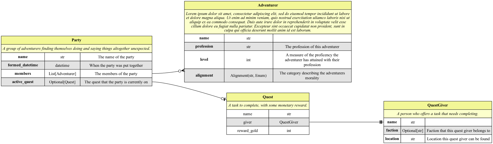
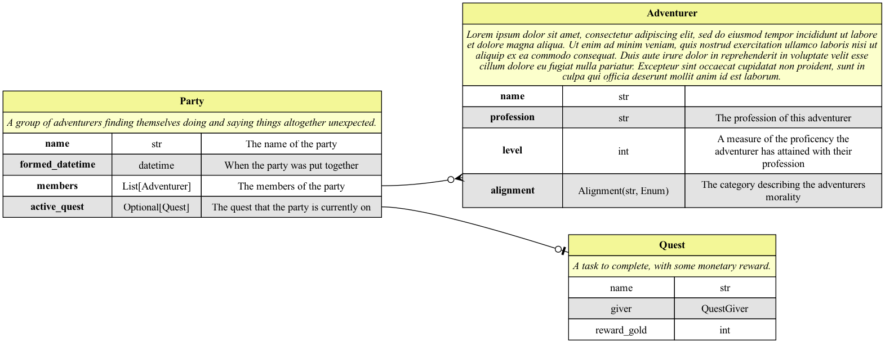
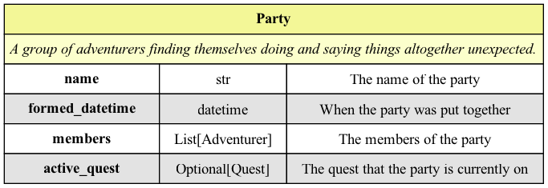

# erdantic: Entity Relationship Diagrams

**erdantic** is a simple tool for drawing 
[entity relationship diagrams (ERDs)](https://en.wikipedia.org/wiki/Data_modeling#Entity%E2%80%93relationship_diagrams) 
for Python data model classes. Diagrams are rendered using the venerable [Graphviz](https://graphviz.org/) library. 
Supported data modeling frameworks are:

- [Pydantic V1](https://docs.pydantic.dev/1.10/)
- [dataclasses](https://docs.python.org/3/library/dataclasses.html) from the Python standard library

Features include a convenient CLI, automatic native rendering in Jupyter notebooks, and easy extensibility to other data 
modeling frameworks. Docstrings are even accessible as tooltips for SVG outputs. Great for adding a simple and clean 
data model reference to your documentation.

<p align="center">

</p>

## Installation

erdantic's graph modeling depends on [pygraphviz](https://pygraphviz.github.io/documentation/stable/index.html) and 
[Graphviz](https://graphviz.org/), an open-source C library.

PyGraphviz can tend to be difficult to install due to the dependence on Graphviz, so please consult the 
[installation instructions](https://pygraphviz.github.io/documentation/stable/install.html) for help.

When installing via pip, just call:

```bash
pip install git+https://github.com/christophertubbs/erdantic.git
```

## Quick Usage

The fastest way to produce a diagram like the above example is to use the erdantic CLI. Simply specify the full dotted 
path to your data model class and an output path. The rendered format is interpreted from the filename extension.

```bash
erdantic erdantic.examples.pydantic.Party -o diagram.png
```

You can also import the erdantic Python library and use its functions.

```python
import erdantic as erd
from erdantic.examples.pydantic import Party

# Easy one-liner
erd.draw(Party, out="diagram.png")

# Or create a diagram object that you can inspect and do stuff with
diagram = erd.create(Party)
diagram.models
#> [PydanticModel(Adventurer), PydanticModel(Party), PydanticModel(Quest)]
diagram.draw("diagram.png")
```

<p align="center">

</p>

You can also limit or expand the number of models shown:


```bash
erdantic erdantic.examples.pydantic.Party -o Party.png -d 0
```

<p align="center">

</p>

```bash
erdantic erdantic.examples.pydantic.Party -o All.png -d 999
```

<p align="center">
    
</p>
